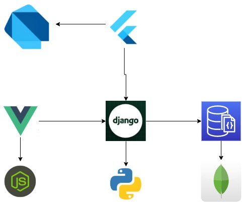

# Road To Rome
There is a phrase that says "all roads get to rome", which is pretty much what this repository is about, here I'll be designing infrastructure and deploying the very same application in different cloud providers and different deployment methods but in the end getting the same result

# The application

As my goal here isn't application development, instead the focus is DevOps, so the application is quite simple, with the following stack:

| End           | Languaje               |  framework|
| :--------:    | :----------:           | --------  |
| Back end      | Python                 | Django    |
| Web Front end | JavaScript             |  Vue 3    |
| App Front end | Dart                   | Flutter   |
| Database      | I gues it counts as JS | MongoDB   |

What it does?

Have you ever found yourself against a wall of redirection links?, where everytime you git a urlshortener it gets you to another url shortener and you migth have to watch an useless ad?.

Well this app is just a db of url shortener links and the direct url you want, lets say you want to acces to an url but you end up going through 7 redirects, 4 ads, a couple of viruses, etc. But you have a very big heart and you upload to this application the first url and the final url, so the next poor soul that want the same content cand find it here and bypass all the hell you went through.

lets call it "Wall Jumper"

a simple diagram:

# The Roads

Every Road will have its own README file so its easier to read, but in general I'll be deployment this application in 3 main ways:

- PaaS
  
  Platform as a service, here I'll use services which require only our code with no changes, the clasical push and go live

- Kubernetes
  
  here I'll use kubernetes manifests which will need the application to work under contenarized context

- Serverless
  
  In this part will be a complete change, as for the previous 2 sections we could use the same code base or modify it a little to work, in this case we will need a complete new codebase as the previous use some kind of framework and this one is only funcionts using the FaaS (Function as a Service) model

# Jump to each road:

- [AWS][1]
- [Azure][2]
- [On - Premise][3]

[1]: ./deploy/aws/README.md
[2]: ./deploy/azure/README.md
[3]: ./deploy/on-premise/README.md