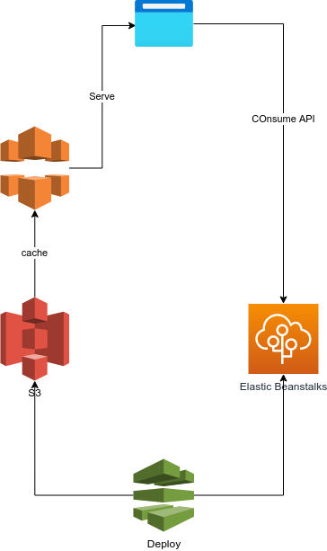
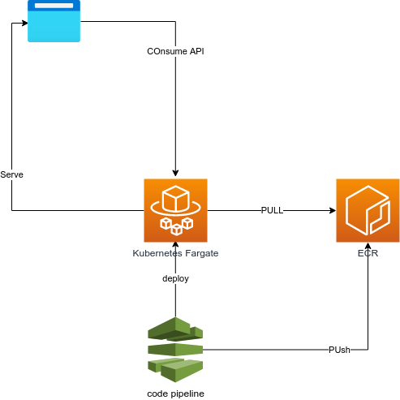

# The AWS road

Down this road we will deploy this application using AWS, in 3 different ways:

- PaaS (platform as a service) using elastick beanstalk and S3
- kubernetes using fargate
- serverless using SAM (serverless application model)

# Assumtions

For this road I am using my aws subcription, which has complete access on it, you migth find yourself restricted by your organization if you are trying to replicate in a company account

# IaaC

For infrastructure as a code I'll be using cloudformation,  these will be at the cloudFormation folder and will follow this syntax:

parameters.yaml
{service}.yaml
main.yaml

# CI/CD

For CI/CD I'll use aws code pipleine, having a diferent file for each part of the application (back,front,app end)

# PaaS

The INfrastructure Diagram:

The pipelines:
# Kubernetes

The Diagram:

The pipelines:
# Serverless

The Diagram:

The pipelines: