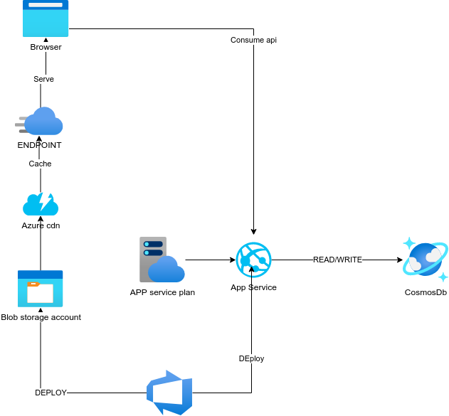
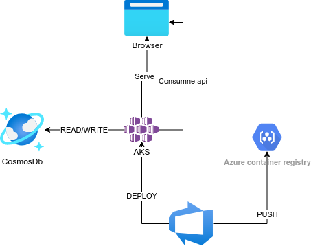
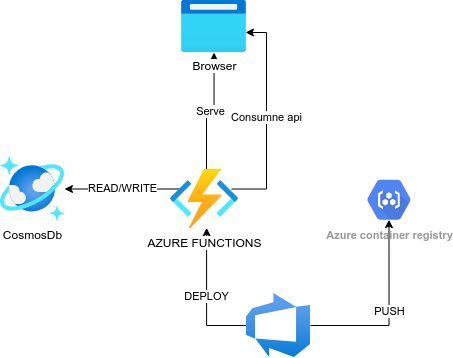

# The Azue Road

Down this road we will deploy this application using Azure, in 3 different ways:

- PaaS (platform as a service) using App Service and Storage Accounts
- kubernetes using AKS
- serverless using Azure Functions

# Assumtions

For this road I am using my azure subcription, which has complete acces on it, you migth find yourself restricted by your organization if you are trying to replicate in a company account

Also I will be using azure devops and azure app center
# IaaC

For infrastructure as a code I'll be using bicep, (the evolution of ARM templates) these will be at the ARM folder and will follow this syntax:

parameters.yaml
{service}.bicep
main.bicep

# CI/CD

For CI/CD I'll use azure pipelines multi stage in yaml format, having a diferent file for each part of the application (back,front,app end)

# PaaS

The INfrastructure Diagram:

The pipelines:
# Kubernetes

The Diagram:

The pipelines:
# Serverless

The Diagram:

The pipelines: